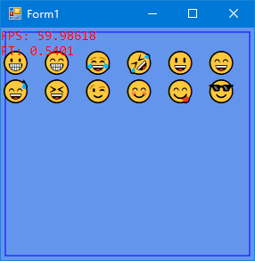

# FlysEngine []
Real-time 2D rendering utilities based on SharpDX/Direct2D.

# Simple example
(Refer to /tree/master/FlysTest)
* Final result:
  
* Create a Windows-form application
* Install the `FlysEngine` nuget package
* Install the `SharpDX.Desktop` nuget package for convenient
* In `Program.cs` file, change the `Application.Run` with: 
  ```
  using (var form = new Form1())
  {
      RenderLoop.Run(form, () => form.Render());
  }
  ```
* In Form1.cs, paste the following code:
```
public partial class Form1 : Form
{
    private readonly XResource xResource = new XResource();
    private readonly FpsManager fpsManager = new FpsManager();

    public Form1()
    {
        InitializeComponent();
    }

    protected override void OnResize(EventArgs e)
    {
        base.OnResize(e);

        if (WindowState != FormWindowState.Minimized && xResource.DeviceAvailable)
        {
            xResource.Resize();
        }
    }

    public void Render()
    {
        if (!xResource.DeviceAvailable)
        {
            xResource.InitializeDevice(Handle);
        }

        var dt = fpsManager.BeginFrame();
        {
            xResource.UpdateLogic(dt);
            xResource.RenderTarget.BeginDraw();
            {
                Draw(xResource.RenderTarget);
            }
            xResource.RenderTarget.EndDraw();
            fpsManager.EndFrame();
            xResource.SwapChain.Present(1, 0);
        }
    }

    private void Draw(DeviceContext renderTarget)
    {
        renderTarget.Clear(Color.CornflowerBlue.ToColor4());
        renderTarget.DrawRectangle(new RectangleF(5, 5, ClientSize.Width - 10, ClientSize.Height - 10),
            xResource.GetColor(Color.Blue));

        renderTarget.DrawText($"😀 😁 😂 🤣 😃 😄 😅 😆 😉 😊 😋 😎",
            xResource.TextFormats[24.0f],
            new RectangleF(0, 22, renderTarget.Size.Width, float.MaxValue),
            xResource.GetColor(Color.White), 
            DrawTextOptions.EnableColorFont);

        renderTarget.DrawText($"FPS: {fpsManager.Fps}\r\nFT: {fpsManager.FrameTimeMs}",
            xResource.TextFormats[15.0f],
            new RectangleF(0, 0, float.MaxValue, float.MaxValue),
            xResource.GetColor(Color.Red));
    }
}
```
* And you're done.
